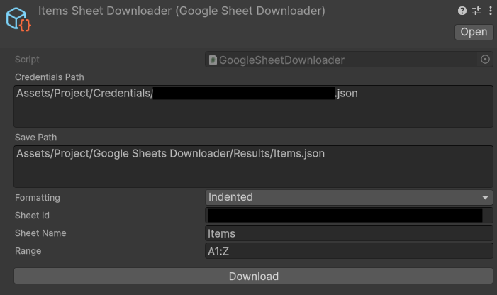

# Google Sheets Downloader

A simple Unity package that downloads data from a Google Sheet and stores it in a JSON file.

## Installation

Install using the [unity package manager](https://docs.unity3d.com/Manual/upm-ui.html) with option - "Install package
from git URL".


This package depends on [NuGetForUnity](https://github.com/GlitchEnzo/NuGetForUnity)
and [UniTask](https://github.com/Cysharp/UniTask) packages. Install them first!

NuGetForUnity URL:
```
https://github.com/GlitchEnzo/NuGetForUnity.git?path=/src/NuGetForUnity
```

UniTask URL:
```
https://github.com/Cysharp/UniTask.git?path=src/UniTask/Assets/Plugins/UniTask
```

After installation, download following dependencies by using NuGetForUnity:

```
<packages>
  <package id="Google.Apis" version="1.69.0" />
  <package id="Google.Apis.Auth" version="1.69.0" manuallyInstalled="true" />
  <package id="Google.Apis.Core" version="1.69.0" />
  <package id="Google.Apis.Sheets.v4" version="1.68.0.3658" manuallyInstalled="true" />
  <package id="Newtonsoft.Json" version="13.0.3" />
  <package id="System.CodeDom" version="7.0.0" />
  <package id="System.Management" version="7.0.2" />
</packages>
```

You can add those dependencies by modifying `packages.config` file or manually by opening
`NuGet > Manage NuGet Packages` window.

Now you can install `Google Sheets Downloader`

URL:

```
https://github.com/Varuzh29/google-sheets-downloader.git
```

## Usage

After installation create downloader scriptable object from `Create > VarCo > Google Sheets Downloader`.

> :warning: **Store those objects in `Editor` folder to not include them in build.** It's important because scriptable
> objects contains editor only code!

Now fill all downloader fields and click "Download".



This will create or replace JSON file in save folder with downloaded JSON data. This JSON can be deserialized as
`IList<IList<object>>`. Each inner list represents a row in the sheet and each object represents a cell.

The rest is up to you!
